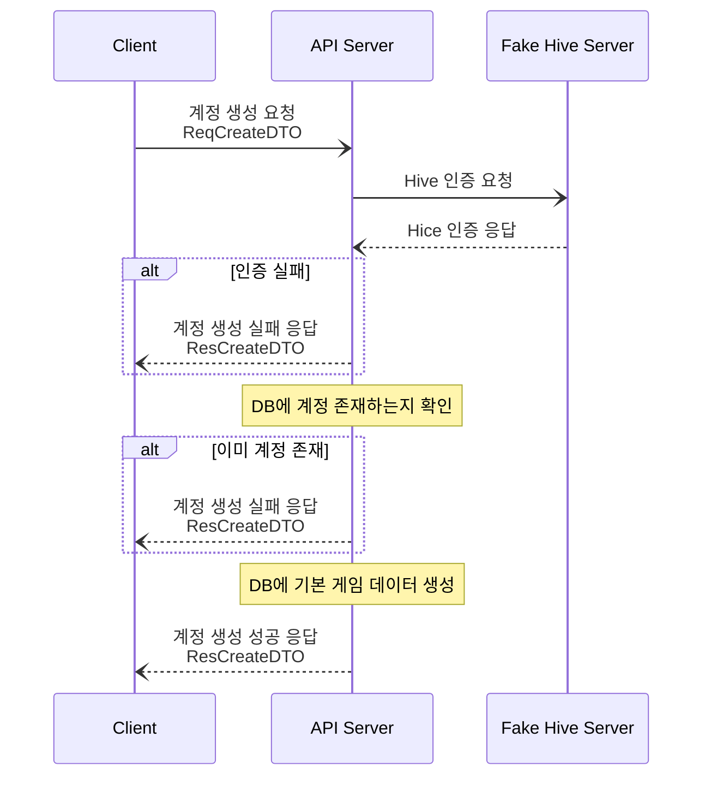

# 계정 생성 API

```mermaid
sequenceDiagram

Client-)API Server:계정 생성 요청<br>ReqCreateDTO
API Server-)Fake Hive Server:Hive 인증 요청
Fake Hive Server--)API Server:Hice 인증 응답
alt 인증 실패
API Server--)Client:계정 생성 실패 응답<br>ResCreateDTO
end
Note over API Server:DB에 계정 존재하는지 확인
alt 이미 계정 존재
API Server--)Client:계정 생성 실패 응답<br>ResCreateDTO
end
Note over API Server:DB에 기본 게임 데이터 생성
API Server--)Client:계정 생성 성공 응답<br>ResCreateDTO
```
